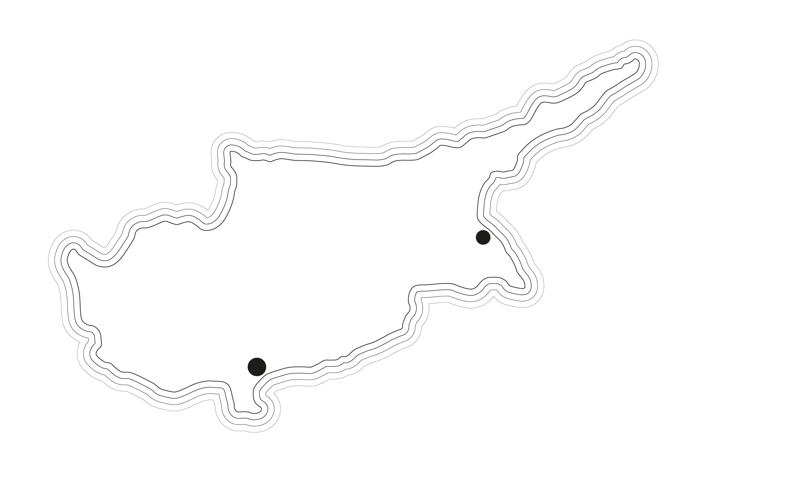

Lorem ipsum 

<!-- Generated by ai2html v0.120.0 - 2024-01-31 22:40 -->
<!-- ai file: 7_1.tif -->

	<!-- Artboard: Artboard_1 -->
	

		
		

			
Famagusta

		

		

			
CYPRUS

		

		

			
Limasol

		

	

<!-- End ai2html - 2024-01-31 22:40 -->
